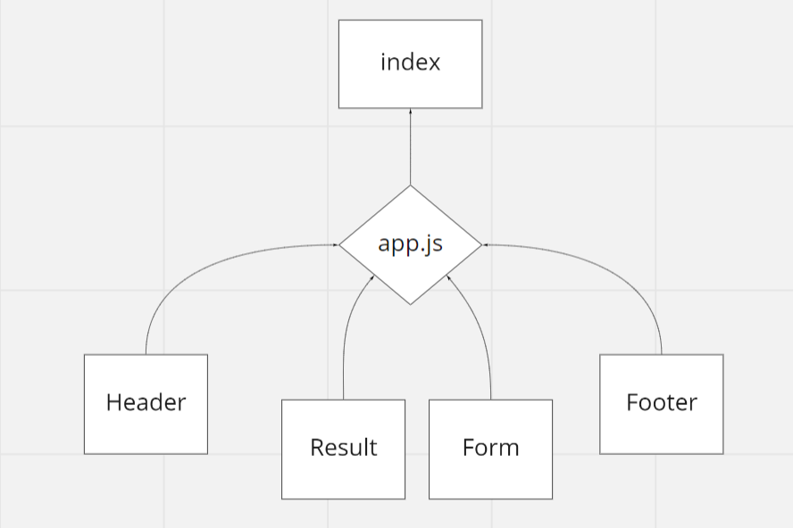
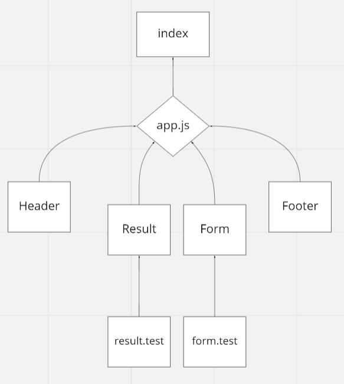

## LAB 26- Component Based UI
## Repo: Reaty

## Descripition:
### RESTy Phase 1: Begin work on the RESTy API testing application

#### Phase 1 Requirements

- build the RESTy application, written in React.
- In this first phase, our goal is to setup the basic scaffolding of the application, with intent being to add more functionality to the system as we go.
- This initial build sets up the file structure so that we can progressively build this application in a scalable manner.

## Links:

#### sandbox url:

Sand Box:
https://codesandbox.io/s/peaceful-sanderson-su6vu?file=/src/index.js

## UML

## LAB 27 - useState() Hook:

### RESTy Phase 2: Retrieving User Input and Managing State

#### In phase 2, we will be receiving user input in preparation of connecting to live APIs, using the useState() hook in our functional components

### Application Flow:

- User enters an API URL
- Chooses a REST Method
- Clicks the “Go” button
- Application fetches data from the URL given, with the method specified
- Displays the response headers and results separately
- Both headers and results should be “pretty printed” JSON

### Technical Requirements 
###### the API  mocked with “fake” data

#### Component Hierarchy and Application Architecture:

#### index.js - Entry Point
#### App.js - Container

 Holds application state: 
- The Request (from the form) and the Response (from the API)
- A class method that can update state
- Renders 2 Child Components:

1- **Form Component**:
- Expects a function to be sent to it as a prop
- Renders a URL entry form
- A selection of REST methods to choose from (“get” should be the default)
- The active selection should be displayed/styled differently than the others
- Renders a Textarea to allow the user to type in a JSON object for a POST or PUT request
- On submit
- Send the Form entries back to the **App** using the method sent down in props
- Form will run the API request
- Toggle the “loading” status before and after the request

2- **Results Component**
- Conditionally renders “Loading” or the data depending on the status of the request
- Expects the count, headers, results to be sent in as props
- Renders the count
- Renders the Result Headers as “pretty” JSON
- Renders the Result Body as “pretty” JSON

### Links:

- git app Actions: https://github.com/Batoolayyad/resty/actions

- sandbox 27: https://codesandbox.io/s/snowy-rain-ghihq

- netlify: https://resty-app-react.netlify.app

### UML:

## LAB 28 - Component Lifecycle / useEffect() Hook
#### RESTy Phase 3: Connect RESTy with APIs, running live requests

### Phase 3 Requirements
In phase 3, we will be connecting RESTy to live APIs, fetching and displaying remote data. Our primary focus will be to service GET requests

##### enter URL to an API and issue a GET request so that I can retrieve it’s data, and see the results returned from an API request in my browser in a readable format

### Application Flow:

- User enters an API URL
- Chooses a REST Method
- Clicks the “Go” button
- Application fetches data from the URL given, with the method specified
- Displays the response headers and results separately
- Both headers and results should be “pretty printed” JSON

### Links:

- git app Actions: 
https://github.com/Batoolayyad/resty/actions

- sandbox 28:
https://codesandbox.io/s/jolly-gareth-xk1om

- netlify: https://resty-app-react.netlify.app

### UML:

### Phase 4 Requirements
 tracking every API call and storing it in history

#### Application Flow:

- User enters an API URL
- Chooses a REST Method
- Clicks the “Go” button
- Application fetches data from the URL given, with the method specified
- Application stores the API request and returned data into state
- Updates the list of previous API calls
- Application Displays the response headers and results separately
- Both headers and results should be “pretty printed” JSON

### Links:

- git app Actions: 

- sandbox 28:

